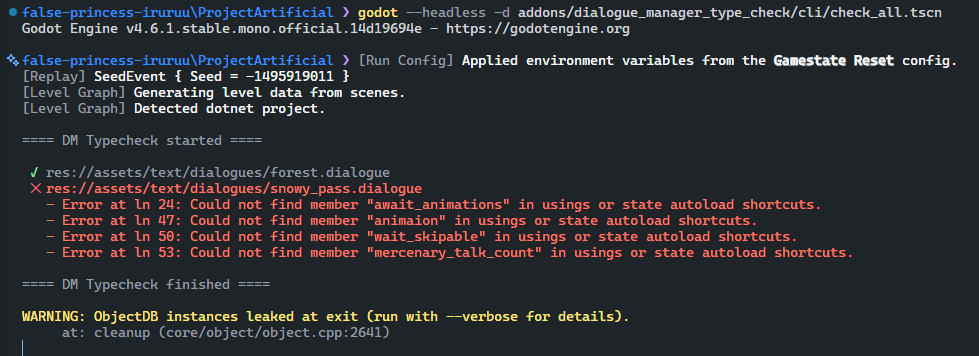

#  Dialogue Manager _- Type Checker_


An addon to for addon--a type checker module for Nathan Hoad's [Dialogue Manager](https://github.com/nathanhoad/godot_dialogue_manager).


This is a mirror of the addon on my local project--I won't be maintaining it much or upload it to the asset library, but feel free to open a PR for increased coverage.

## Installation

Version number tracks the base addon's version. If the base addon's version is higher, it may or may not work with that version.

1. Download or clone the repo.
2. Copy `addons/dialogue_manager_type_check` to your project's addon folder.
3. Make sure dialogue_manager is already installed and activated.
4. (If using C#) Run `dotnet build`.
5. Activate "Dialogue Manager Type Checker" in the plugins.

## Features

### Menu Tool

Adds an editor tool at `Project > Tools > Dialogue > Check Type` to analyze the type correctness of a dialogue file.


Type errors are printed in the output:


### CLI

Run the following command to verify all dialogue files in a project:

```sh
godot --headless -d addons/dialogue_manager_type_check/cli/check_all.tscn
```

The commands return a non-zero exit code if errors are found, so you can easily plug this into your CI.



### Editor

Adds highlighting in the dialogue editor. Click on the warning icon in the gutter to see more detail on the type error.


## Syntax Coverage

The current analyzer should cover most basic use-cases that is valid expressions for Dialogue Manager, but there are a few exceptions and limitations. Some of them are just not implemented yet and may either be ignored or a false positive. Others are limitation due to GDScript's reflection API.

| Syntax           | Example                               | Comment                                                                                                                                         |
| ---------------- | ------------------------------------- | ----------------------------------------------------------------------------------------------------------------------------------------------- |
| Chained function | `get_tree().quit()`                   | Not implemented.                                                                                                                                |
| Assignments      | `GameManager.string_val == 23`        | Not implemented.                                                                                                                                |
| Built-in types   | `GameManager.string_val.to_lowered()` | GDScript does not expose function API for built-in types. Could be manually coded, but likely not worth the overhead.                           |
| Static member    | `GameManager.static_node.queue_fre()` | GDScript does not expose API to query static members. Partially implemented with regex search, but cannot consistently obtain member type info. |
